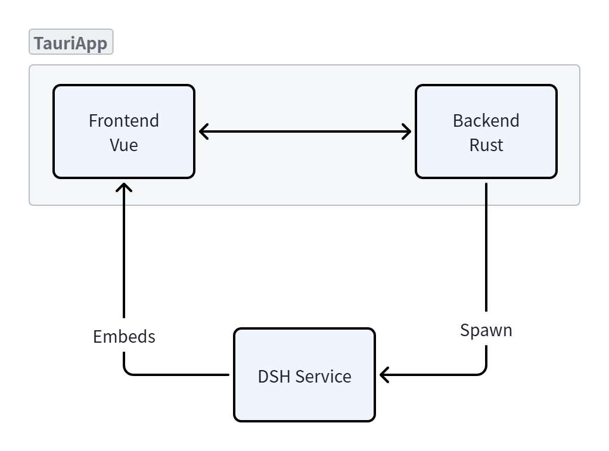

# DSH Desktop

> 把 DeepSeek Harness (DSH) 的 Web 界面装进桌面壳：一键启动、托盘驻留，无需每次打开终端敲命令。

[English](./README.md)

[](https://github.com/szWrn/DSHDesktop)
[](https://tauri.app)
[](https://vuejs.org)
[](https://www.rust-lang.org)
[](LICENSE.txt)

DSH Desktop 是一个非官方的第三方桌面客户端，基于 Tauri 2 + Vue 3 构建。它在本地启动 DSH 的 Web 服务，并把界面嵌入桌面窗口，让你像使用本地 App 一样使用 DeepSeek Harness。

---

## 功能特性

- **一键启动**：自动拉起 DSH 服务，并轮询等待其就绪，无需手动敲 `npx` 命令。
- **一键停止**：自动定位并结束占用 3080 端口的 DSH 进程。
- **托盘驻留**：关闭窗口后最小化到系统托盘，后台持续运行，托盘菜单可直接切换服务开关。
- **状态监测**：状态圆点实时反映服务在线/离线，服务意外崩溃也能被检测到。
- **跟随系统语言**：自动跟随系统语言切换中文/英文界面。
- **无边框窗口**：自带最小化 / 最大化 / 关闭按钮，界面更简洁。
- **跨平台**：支持 Windows、macOS、Linux。

---

## 截图


---

## 快速开始

### 前置要求

- **Windows**、**macOS** 或 **Linux**
- **Node.js**（需要 `npx` 在 PATH 中；首次启动会通过 `npx` 拉取 `@deepseek-ai/dsh`，需要联网）
- **macOS / Linux**：需要安装 `lsof` 用于定位 DSH 进程（macOS 自带；Debian/Ubuntu 可用 `sudo apt install lsof` 安装）
- 确保 `127.0.0.1:3080` 端口空闲

### 直接使用

从 [Releases](../../releases) 下载最新安装包，双击安装即可。

### 从源码构建

```bash
# 1. 安装前端依赖
npm install

# 2. 开发模式运行（Tauri 窗口 + HMR）
npm run tauri dev

# 3. 打包安装包（输出到 src-tauri/target/release/bundle）
npm run tauri build
```

---

## 使用说明

1. 打开应用，点击 **启动**：应用会启动本地 DSH 服务，并把 `http://127.0.0.1:3080` 的界面嵌入窗口。
2. 点击 **停止**：结束 DSH 服务。
3. 点击右上角 **关闭**：窗口隐藏到系统托盘（不会退出）。
4. 右键点击托盘图标：可 **显示窗口 / 启动·停止服务 / 退出**。选择「退出」会一并清理 DSH 进程。

---

## 工作原理



- **启动**：检查 `127.0.0.1:3080` 是否空闲 → 静默执行 `npx --yes @deepseek-ai/dsh web`（Windows 下不弹出控制台窗口）→ 轮询等待端口就绪。
- **停止**：定位占用 3080 端口的进程（Windows 用 `netstat -ano`，macOS/Linux 用 `lsof`），然后结束它（Windows 用 `taskkill`，macOS/Linux 用 `kill`）。
- **状态**：前端每 3 秒调用 `is_dsh_service_running` 检测端口，驱动状态圆点与托盘菜单文字。

---

## 常见问题

**Q：提示端口 3080 被占用？**
说明已有 DSH 服务（或其它进程）在运行。先关闭占用端口的程序，或点击「停止」后再「启动」。

**Q：点了启动没反应 / 启动失败？**
确认已安装 Node.js 且 `npx` 可用（终端执行 `npx --version` 验证），并保持联网以拉取 `@deepseek-ai/dsh`。

**Q：支持 macOS / Linux 吗？**
支持。DSH Desktop 可在 Windows、macOS、Linux 上运行；macOS/Linux 下请确保已安装 `lsof`。

**Q：这是官方应用吗？**
不是。DSH Desktop 是第三方社区项目，与 DeepSeek 官方无关。

---

## 技术栈

| 层             | 技术                                                                           |
| -------------- | ------------------------------------------------------------------------------ |
| 桌面框架       | [Tauri 2](https://tauri.app) (Rust)                                            |
| 前端           | [Vue 3](https://vuejs.org) + [Vite](https://vitejs.dev)                        |
| 国际化         | `rust-i18n` + `vue` 前端文案                                                   |
| 进程管理       | Rust `std::process` + `netstat`/`taskkill`（Windows）· `lsof`/`kill`（macOS/Linux） |

---

## 贡献

欢迎提交 Issue 和 Pull Request。贡献前请阅读构建步骤（见上文），提交前先本地验证 `npm run tauri dev` 可正常运行。

Good first issues：自动发布 CI、应用内自动更新、安装器图标与元数据完善。

---

## 许可证

[MIT](LICENSE.txt) © 2026 [szWrn](https://github.com/szWrn)
